# Real-time continuous tension allocation for suspended CDPRs under marine disturbances: a zonotope-nullspace framework
author: Zongbin Hou

## Abstract

In offshore cargo transfer wave-induced multidimensional motions severely threaten replenishment stability. Suspended cable-driven parallel robots are promising for motion compensation owing to their lightweight structure and large workspace. However conventional tension allocators use only instantaneous wrench data and often yield discontinuous commands under sudden disturbances causing vibration and performance loss.

To address this a real-time continuous tension allocation algorithm is developed using hybrid zonotope geometry and null-space parameterization. The high-dimensional feasible tension set is decomposed into connected convex leaves enabling efficient generation of admissible candidates without online optimization. A dual selection mechanism combines temporal adjacency screening and ellipsoidal focusing to ensure continuity and concentrate the search near an optimal region. Tension vectors are sampled on shared boundaries between adjacent leaves to enhance smoothness and avoid corner effects.

Experiments on a 5-DOF suspended cable-driven robot under wind and deck motion show that the proposed method reduces RMS position and orientation tracking errors by up to 40% compared to conventional approaches. The results provide a practical solution for robust tension management in dynamic marine environments.

## Introduction

Wave-induced motion compensation devices are critical for ensuring the safety and efficiency of offshore cargo transfer operations [1]. Under severe marine environmental conditions, replenishment between two closely moored vessels is significantly affected by wind and wave disturbances. The cargo suspended between the vessels undergoes multidimensional motion, which complicates stable docking and precise positioning. Conventional passive damping systems or rigid mechanical linkages lack the capability to effectively mitigate the multidimensional vibrations induced by complex wave excitations, thereby posing substantial challenges to operational reliability.

As illustrated in Fig. 1, cable-driven parallel robots (CDPRs) present a promising solution to this problem. Owing to their lightweight architecture, low moving inertia, extensive workspace, and capacity for active multidimensional motion compensation, CDPRs can dynamically adjust the tensions in multiple flexible cables to regulate the pose of the suspended payload in real time [2]. By precisely coordinating cable forces, these systems actively counteract the relative motion between vessels caused by wave action, thereby enabling high-precision, robust, and safe cargo transfer even under harsh sea conditions.

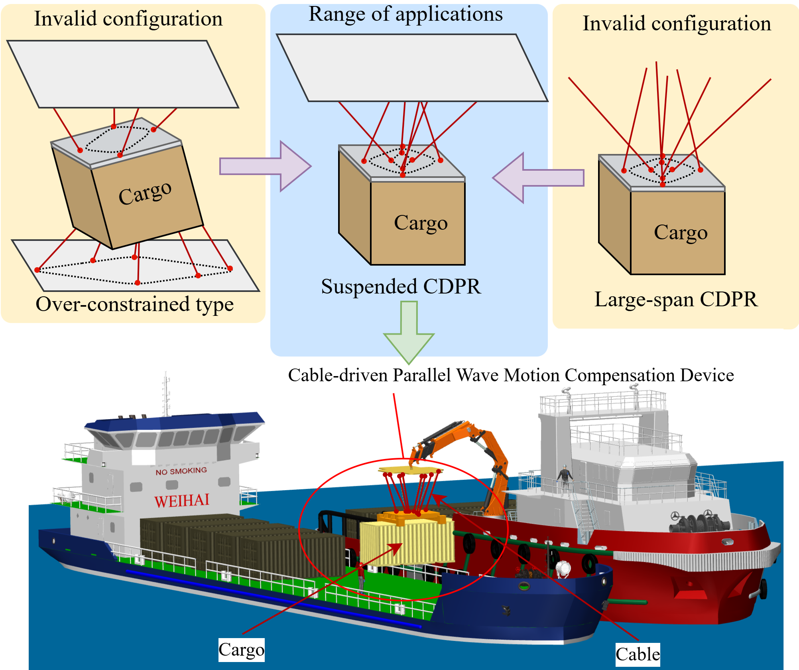
*Figure 1: Configuration of the suspended cable-driven wave motion compensation device. This paper adopts a small-span suspended CDPR structure which avoids the catenary effect. Compared to overconstrained configurations the suspended layout facilitates interaction with the environment.*

However, active compensation cannot be achieved by the traditional inverse kinematics approach alone, which maps desired poses to cable lengths. Early methods often treated cables as rigid, inextensible rods and assumed perfect motor tracking. They ignored actuator dynamics, cable elasticity, and tension transients. The resulting static workspace model fails to capture the system's nonlinear and time-varying behavior under strong disturbances. This leads to significant degradation in trajectory tracking accuracy and poor disturbance rejection.

Therefore, an advanced control framework that accounts for system dynamics is essential. Robust algorithms such as sliding mode control [3], active disturbance rejection control [4], or fractional-order PID [5] should be adopted to achieve accurate end-effector pose tracking. These methods can effectively handle uncertain wave-induced disturbances and adapt to time-varying system parameters, forming the foundation for active sway suppression.

It is important to note that the performance of any trajectory tracking controller depends critically on the underlying tension allocation strategy. The motion of a CDPR is achieved by coordinated cable tensions that balance the external forces and moments on the end-effector [6]. Since cables can only pull, all must remain taut at all times. Otherwise, the system loses controllability or even becomes unstable.

Thus, a real-time tension allocation algorithm must be designed to work with the high-level controller. It must satisfy non-negative tension constraints while optimizing load distribution among cables to keep the system always feasible. The concept of force-closure workspace was first introduced to describe [7] whether a set of cable forces can balance a given external wrench. However, this concept is purely theoretical. It ignores motor limits and physical cable properties and may suggest infinite tensions.

Later, the notion of tension feasible workspace [8] was proposed to incorporate practical constraints. Tension allocation is also formulated as an optimization problem. First, the Jacobian matrix establishes the mapping between end-effector wrench and cable forces. Then, using system redundancy, multi-objective optimization is performed under unidirectional tension and actuator limits. Common goals include minimizing total tension, balancing load distribution, or improving energy efficiency.

The accuracy and effectiveness of this process directly affect the robot's payload capacity, motion precision, and dynamic performance. It is a core component for achieving high-precision control in CDPR systems.

Stable operation of a CDPR requires real-time and continuous tension allocation. Early studies treated tension allocation as an optimization problem. They mainly used linear programming [9] or quadratic programming [10] to achieve static tension distribution. The goal was to find a tension vector that minimizes a given objective function while satisfying the non-negative tension constraint. A common choice for the objective is the p-norm of the tension vector.

On one hand, a low p-norm offers high computational efficiency but results in a small solution space and poor system robustness. On the other hand, a high p-norm enlarges the feasible region but leads to complex computation and convergence difficulties. It may also cause large jumps in tension commands. Therefore, most methods adopt 2-norm or 4-norm optimization [11], or relative p-norm formulations [12]. However, Verhoeven and others have shown that these norm-based approaches can produce discontinuous tension solutions [13].

These norm-based methods are typically static. They decompose the current end-effector wrench into cable tensions without considering temporal continuity. Under sudden disturbances, they cannot guarantee smooth tension evolution along dynamic trajectories. In practice, this often causes vibrations in marine CDPR wave compensation systems. Some attempts have been made to address this issue. For example, Hassan and colleagues applied the Dykstra alternating projection method, but it increased iteration time significantly [14].

Later research focused on improving both real-time performance and allocation rationality [15, 16]. Especially for multi-degree-of-freedom systems with complex constraints, null-space-based tension allocation has shown strong potential. Jia and coworkers proposed a stiffness-optimized trajectory planner using redundant null-space parameterization. However, their method solves trajectories offline and is unsuitable for highly disturbed environments [17]. Fabritius and team used Jacobian null-space nesting to generate continuous tension distributions by layering tasks of different priorities while maintaining force balance, but they did not perform additional task optimization [18]. Gao and colleagues combined null-space and geometric methods to develop a fast and robust allocator for two-redundancy cases, yet their approach becomes cumbersome in high-dimensional redundant spaces [19]. Sun and others addressed input saturation caused by discontinuous external moments [20].

Most of these algorithms construct a tension feasible region based on specific cable layouts to avoid tension limits. However, they suffer from the curse of dimensionality in highly redundant systems. Another line of work uses hybrid joint-space control [21, 22]. In this approach, some cables are controlled kinematically while the remaining redundant cables maintain overall tension, reducing computational complexity. Building on deeper understanding of redundancy, Ameri and colleagues proposed a non-affine control method that directly outputs tension without complex optimization. Yet it cannot exploit redundancy for secondary objectives [23].

Recently, with advances in machine learning, some researchers have explored reinforcement learning for tension allocation. Lu and coworkers combined reinforcement learning with sliding mode observers [24, 25]. Joyo and team integrated deep reinforcement learning with PID control [26]. These hybrid methods show strong real-time performance and robustness. However, their practical deployment is limited by the difficulty of designing task-specific reward functions and the high cost of offline training.

Thus, combining null-space theory with geometric methods can balance dynamic continuity and multi-objective optimization. Yet new solution strategies are needed to overcome the curse of dimensionality.

In cargo transfer operations, anti-sway and vibration suppression place strict demands on the continuity and stability of tension allocation. Conventional methods usually perform instantaneous optimization based only on the current pose and load. They ignore the connection to the previous tension solution. When facing sudden disturbances such as wind gusts, cargo swing, start-stop shocks, or sharp path changes, these methods often generate abrupt tension commands. The actual tensions cannot track such rapid changes, leading to performance degradation.

To address this, this paper proposes a high-dimensional continuous tension allocation algorithm based on hybrid zonotopes. The tension feasible region is first decomposed into a set of connected convex leaves. Then, a dual mechanism is introduced that combines temporal adjacency screening with ellipsoidal focusing to dynamically identify a local region satisfying continuity while remaining close to optimal. Finally, tension vectors are sampled on the shared boundary faces of adjacent leaves to avoid corner effects. This yields a smooth, feasible, and step-wise near-optimal tension solution. The paper presents the principle, procedure, and theoretical foundation of the algorithm. Simulation experiments are conducted to verify its effectiveness and superiority in high-dimensional scenarios.

This paper is organized as follows. Section 1 presents the introduction and motivation. The proposed hybrid zonotope-based tension allocation method is detailed in Section 2. Simulation results validating the approach under wave-induced disturbances are provided in Section 3, followed by experimental validation on a physical prototype in Section 4. Finally, conclusions and future work are summarized in Section 5.

## High-Dimensional continuous tension allocation algorithm based on hybrid zonotope decomposition

### Zonotope-based formulation of the high-dimensional continuous tension allocation problem

Unlike conventional rigid serial or parallel robots, the workspace of a cable-driven wave motion compensation device is closely coupled with its tension distribution. This relationship is not intuitive. Therefore, dynamic force balance must be considered together with external loads to ensure effective operation.

Let $\boldsymbol{W} \in \mathbb{R}^5$ denote the total external disturbance wrench acting on the moving platform and cargo, which includes gravitational force, wind loads, wave-induced forces, and other environmental effects. Let $\boldsymbol{F}_{\text{desired}} \in \mathbb{R}^5$ represent the desired active wrench that must be generated by the cable tensions to achieve reference trajectory tracking (e.g., anti-sway motion control during cargo transfer) while simultaneously counteracting $\boldsymbol{W}$. The cable tensions $\boldsymbol{\tau} \in \mathbb{R}^m$ ($m = 8$) generate this wrench through the force transmission Jacobian matrix $\boldsymbol{J} \in \mathbb{R}^{5 \times m}$.

The dynamic equilibrium condition is given by
$$
\boldsymbol{J} \boldsymbol{\tau} = \boldsymbol{F}_{\text{desired}}
$$
where $\boldsymbol{F}_{\text{desired}}$ is computed by a motion controller and typically includes terms for disturbance compensation and trajectory tracking.

To ensure physical feasibility, each cable tension must satisfy:
$$
\tau_{\text{min}} \leq \tau_i \leq \tau_{\text{max}}, \quad i = 1, 2, \dots, m
$$
with $0 < \tau_{\text{min}} < \tau_{\text{max}}$ denoting the minimum and maximum allowable tensions.

> **Remark:** The tension distribution problem in a CDPR is thus a constrained linear inverse problem: find a tension vector $\boldsymbol{\tau}$ that satisfies the dynamic balance equation while respecting the tension bounds. This formulation enables simultaneous disturbance rejection and precise trajectory tracking, which is critical for dynamic cargo transfer in marine environments with wave motion.

As shown in Figure 2, the proposed wave motion compensation device uses eight cables, so $m = 8$. The system has $r = m - 5 = 3$ degrees of redundancy. The dynamic equilibrium equation is underdetermined. Its general solution can be written as $\boldsymbol{\tau} = \boldsymbol{\tau}_p + \boldsymbol{N} \boldsymbol{\lambda}$, where $ \boldsymbol{\tau}_p = \boldsymbol{J}^{+} \boldsymbol{F}_{\text{desired}} $ is a particular solution, $\boldsymbol{N} \in \mathbb{R}^{m \times r}$ spans the null space of $\boldsymbol{J}$, and $\boldsymbol{\lambda} \in \mathbb{R}^r$ is a free parameter vector. Thus, the solution space is an $r$-dimensional affine subspace embedded in $\mathbb{R}^m$.

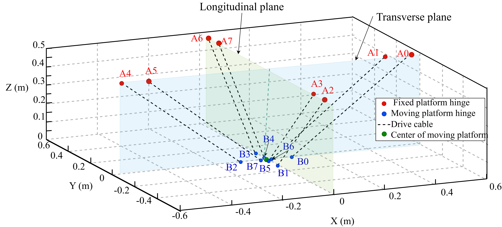
*Figure 2: Configuration of the suspended cable-driven wave motion compensation device.*

It should be noted that the system in Figure 2 adopts a suspended configuration. In this setup, gravity imposes unilateral constraints on the end-effector, requiring all cable tensions to remain positive. These constraints significantly limit the mapping from cable tensions to directional forces at the end-effector. This section focuses on accounting for this limitation by distributing the required wrench as evenly as possible across all cables.

The system redundancy allows the solution to be decomposed into a particular solution and a null-space component. This reduces the constraint handling to an $r$-dimensional space, where $r = m - 5 = 3$. Let $e_i$ be the $i$-th standard basis row vector. Substituting the tension bounds $\tau_{\min} \leq \tau_i \leq \tau_{\max}$ into the general solution yields
$$
e_i^\top (\boldsymbol{\tau}_p + \boldsymbol{N} \boldsymbol{\lambda}) \leq \tau_{\max}, \quad
-e_i^\top (\boldsymbol{\tau}_p + \boldsymbol{N} \boldsymbol{\lambda}) \leq -\tau_{\min}, \quad i = 1, \dots, m
$$

These inequalities can be written in compact form as
$$
\boldsymbol{A} \boldsymbol{\lambda} \leq \boldsymbol{b}, \quad
\boldsymbol{A} =
\begin{bmatrix}
\boldsymbol{N} \\
-\boldsymbol{N}
\end{bmatrix}
\in \mathbb{R}^{2m \times r}, \quad
\boldsymbol{b} =
\begin{bmatrix}
\tau_{\max} \mathbf{1} - \boldsymbol{\tau}_p \\
\boldsymbol{\tau}_p - \tau_{\min} \mathbf{1}
\end{bmatrix}
\in \mathbb{R}^{2m}
$$

The compact equation describes a convex polytope as the intersection of half-spaces. It represents the set of all $\boldsymbol{\lambda} \in \mathbb{R}^r$ that satisfy dynamic equilibrium and tension limits. The vector $\boldsymbol{b} \in \mathbb{R}^{2m}$ reflects the margin between the particular solution $\boldsymbol{\tau}_p$ and the tension boundaries. The collection of these linear constraints provides a half-space representation (H-representation) of the feasible tension set in the null space. As the redundancy degree increases, the dimension of this polytope also increases, which raises the computational complexity of tension allocation methods.

Thus, the tension feasible region in the null space $\boldsymbol{\lambda}$ is defined as
$$
X_{\text{TFR}} = \{ \boldsymbol{\lambda} \in \mathbb{R}^r \mid \boldsymbol{A} \boldsymbol{\lambda} \leq \boldsymbol{b} \}
$$

The image of this feasible region mapped into the tension space $\boldsymbol{\tau}$ is $S_\tau = \{ \boldsymbol{\tau} \in \mathbb{R}^m \mid \boldsymbol{\tau} = \boldsymbol{\tau}_p + \boldsymbol{N} \boldsymbol{\lambda},\; \boldsymbol{\lambda} \in X_{\text{TFR}} \}$, which constitutes the complete set of physically feasible tension vectors.

This section distinguishes several concepts. First, the **tension space** refers to the $m$-dimensional real vector space denoted by $\mathbb{R}^m$, which consists of all possible tension vectors. Each point $\boldsymbol{\tau} \in \mathbb{R}^m$ represents a set of cable tensions. The tension space is the original decision space where the physical constraints $\tau_{\min} \leq \tau_i \leq \tau_{\max}$ and the dynamic equilibrium constraint $\boldsymbol{J} \boldsymbol{\tau} = \boldsymbol{F}_{\text{desired}}$ are both defined. Second, the **null-space parameter space** is the low-dimensional space spanned by the redundant degrees of freedom of the cable-driven system, denoted as $\mathbb{R}^r$, where the redundancy degree is $r = m - 5 = 3$. In the equation $\boldsymbol{\tau} = \boldsymbol{\tau}_p + \boldsymbol{N} \boldsymbol{\lambda}$, the vector $\boldsymbol{\lambda} \in \mathbb{R}^r$ belongs to this space. This space does not exist independently. It is induced from the tension space through null-space parameterization. Therefore, the null-space parameter space describes the degrees of freedom for adjusting tensions without changing the end-effector wrench.

### Design of a high-dimensional continuous tension allocation algorithm based on hybrid zonotope decomposition

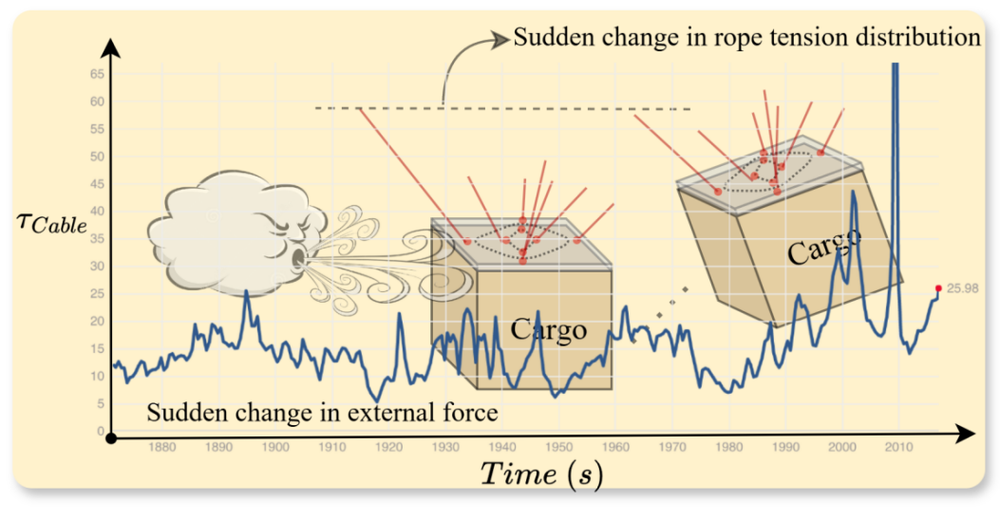
*Figure 3: Sudden tension jump caused by abrupt external disturbance.*

As shown in Figure 3, in offshore cargo compensation scenarios, many uncertain disturbances exist. These disturbances can cause abrupt changes in the external wrench acting on the payload. Conventional tension allocation strategies only consider the current wrench. They assume smooth variation of external forces and moments. Under sudden disturbances, such methods fail to maintain continuity and stability of tension output. This may lead to system vibration, position drift, or actuator saturation. Compensation accuracy and operational safety are severely compromised.

Therefore, the following design principles are established for the high-continuity tension allocation algorithm proposed in this section. First, the instantaneous change in tension between control cycles is used as the core continuity metric. This ensures smooth transition of tension at every time step. Second, when a conflict arises between wrench equilibrium requirements and tension continuity, continuity is prioritized to achieve stable dynamic response. Third, for high-dimensional redundant actuation spaces, a fast solution mechanism is designed to generate feasible and continuous tension distributions in real time while satisfying physical constraints and stability requirements.

As shown in Figure 4, this paper proposes a high-continuity tension allocation algorithm tailored for high-dimensional redundant cable-driven systems. One control cycle is defined as one frame. The algorithm uses the instantaneous tension change as the primary continuity indicator. Equivalently, it enforces a bound on the time derivative of tension, that is, $\|\dot{\boldsymbol{\tau}}(t)\| \leq \delta_\tau$ within each control cycle. This guarantees smooth tension output over time. To address computational efficiency, the high-dimensional tension allocation problem is transformed into a structured search guided by geometric heuristics.

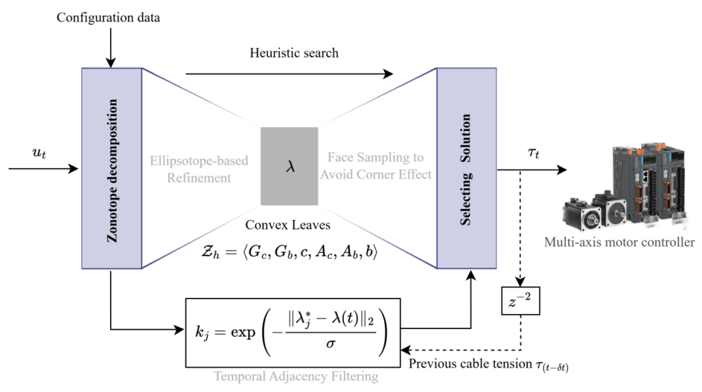
*Figure 4: Hybrid zonotope based tension allocation method.*

The following presents the conceptual definition of the zonotope-based tension allocation method. First, a zonotope is constructed so that the geometric structure of the tension feasible region and the continuity set can be expressed and operated on in a consistent manner. This provides a solid foundation for generating and selecting candidates that are both feasible and continuous.

Although the tension feasible region in the null-space parameter space $X_{\text{TFR}}$ was derived in Section 2.1 and identified as a convex polytope, its shape is irregular. Random sampling in this space requires pointwise verification of $\boldsymbol{A}\boldsymbol{\lambda} \leq \boldsymbol{b}$, which compromises real-time performance. To enable efficient feasible sampling, an axis-aligned hypercube strictly contained in $X_{\text{TFR}}$ is constructed. This hypercube is then mapped to a zonotope in the tension space. Every point inside this zonotope satisfies the tension constraints. The definition of a zonotope is given below.

**Definition 1 (Zonotope):** Given a center $\boldsymbol{c}$ and a generator matrix $\boldsymbol{G} \in \mathbb{R}^{m \times p}$, a zonotope is defined as
$$
Z(\boldsymbol{G},\boldsymbol{c}) = \boldsymbol{c} + \boldsymbol{G}\boldsymbol{\xi}, \quad \boldsymbol{\xi} \in [-1,1]^p
$$

Equivalently, a zonotope is the Minkowski sum of $p$ line segments $[-\boldsymbol{g}_j, \boldsymbol{g}_j]$ translated by $\boldsymbol{c}$, where $\boldsymbol{g}_j$ is the $j$-th column of $\boldsymbol{G}$. That is, $Z(\boldsymbol{G},\boldsymbol{c}) = \boldsymbol{c} \oplus \bigoplus_{j=1}^p [-\boldsymbol{g}_j,\boldsymbol{g}_j]$. Because zonotopes are closed under linear maps and translations, the tension set becomes a zonotope when the feasible region in the redundancy space is restricted to an axis-aligned hypercube $[-\boldsymbol{\rho},\boldsymbol{\rho}] \subset \mathbb{R}^r$. Specifically,
$$
S_\tau^{\text{in}} = \{ \boldsymbol{\tau}_p + \boldsymbol{N}\boldsymbol{\lambda} \mid \boldsymbol{\lambda} \in [-\boldsymbol{\rho},\boldsymbol{\rho}] \} = Z\left( \boldsymbol{N}\, \text{diag}(\boldsymbol{\rho}),\,\boldsymbol{\tau}_p \right)
$$

This zonotope is convex and bounded under linear mapping. Any interior point can be efficiently generated by uniform sampling of $\boldsymbol{\xi} \in [-1,1]^r$. More importantly, if the hypercube $[-\boldsymbol{\rho},\boldsymbol{\rho}]$ is constructed to be strictly contained in the H-representation of the tension feasible region $\{\boldsymbol{\lambda} \mid \boldsymbol{A}\boldsymbol{\lambda} \leq \boldsymbol{b}\}$, then all tension vectors inside the resulting zonotope satisfy the physical bounds $\tau_{\min} \leq \tau_i \leq \tau_{\max}$. This avoids time-consuming pointwise validation or optimization, making the zonotope an ideal geometric carrier for constructing safe candidate sets.

To ensure that the axis-aligned hypercube $[-\boldsymbol{\rho}, \boldsymbol{\rho}]$ is contained within the tension feasible region $X_{\text{TFR}}$, the condition $\lvert \boldsymbol{A} \boldsymbol{\lambda} \rvert \leq \boldsymbol{b}$ must hold. To maximize the sampling radius while fully exploiting the redundancy space, the following linear program is solved: $\max_{\boldsymbol{\rho} \geq \boldsymbol{0}} \sum_{i=1}^{r} \rho_i$ subject to $\lvert \boldsymbol{A} \boldsymbol{N} \boldsymbol{\rho} \rvert \leq \boldsymbol{b}$. After obtaining the optimal half-length vector $\boldsymbol{\rho}^*$, the generator matrix and center of the inner zonotope are defined as $\boldsymbol{G}_{\text{in}} = \boldsymbol{N} \operatorname{diag}(\boldsymbol{\rho}^*)$ and $\boldsymbol{c}_{\text{in}} = \boldsymbol{\tau}_p$, which determine the base point and directional extents of the zonotope along each generator direction. The resulting inner zonotope is given by $S_\tau^{\text{in}} = Z(\boldsymbol{G}_{\text{in}}, \boldsymbol{c}_{\text{in}})$.

It should be noted that although the above procedure models the tension feasible region as a zonotope, the standard construction relies on the minimum-norm particular solution $\boldsymbol{\tau}_p = \boldsymbol{J}^+ \boldsymbol{F}_{\text{desired}}$ as the center. Due to the asymmetry of tension bounds, some components of $\boldsymbol{\tau}_p$ may lie close to or even outside the feasible limits. In such cases, the resulting zonotope becomes severely eccentric.

If an axis-aligned inner hypercube is still built around $\boldsymbol{\tau}_p$, its half-length vector will be limited by the tightest constraint on one side. This leads to an overly conservative zonotope with a drastically reduced sampling volume. The algorithm then struggles to find candidates that are both continuous and feasible, which may cause tension spikes and end-effector vibration.

Therefore, a symmetric center-shifting strategy is introduced in this section. A new center $\boldsymbol{\lambda}_c$ is selected in the null-space parameter space $\boldsymbol{\lambda}$ such that the corresponding tension $\boldsymbol{c} = \boldsymbol{\tau}_p + \boldsymbol{N}\boldsymbol{\lambda}_c$ stays away from the boundaries. This enables the construction of a larger inner zonotope under locally symmetric constraints, thereby improving sampling robustness and continuity.

At a given time step, for the tension $\tau_i$ of the $i$-th cable to be centered within its allowable bounds $[\tau_{\min}, \tau_{\max}]$, the following condition must be satisfied:
$$
\tau_i = (\boldsymbol{\tau}_p)_i + (\boldsymbol{N}\boldsymbol{\lambda}_c)_i = \frac{\tau_{\min} + \tau_{\max}}{2}
\quad \implies \quad
(\boldsymbol{N}\boldsymbol{\lambda}_c)_i = \frac{\tau_{\min} + \tau_{\max}}{2} - (\boldsymbol{\tau}_p)_i
$$
where $(\boldsymbol{\tau}_p)_i$ denotes the $i$-th component of the particular solution vector $\boldsymbol{\tau}_p$.

Under any fixed particular solution $\boldsymbol{\tau}_p$, the centering offset for the $i$-th cable is defined as
$$
m_i = \frac{1}{2}\left(\tau_{\min} + \tau_{\max}\right) - e_i^\top \boldsymbol{\tau}_p
$$
which represents the required compensation in the null space of the system to achieve centering of $\tau_i$. This offset, $m_i$, quantifies the adjustment needed in the redundant tension space to maintain optimal tension distribution under dynamic operating conditions.

The offset vector for all cables is $\boldsymbol{m} = \begin{bmatrix} m_1 & \dots & m_m \end{bmatrix}^\top$. The goal becomes finding $\boldsymbol{\lambda}_c \in \mathbb{R}^r$ such that $\boldsymbol{N}\boldsymbol{\lambda}_c \approx \boldsymbol{m}$. Since $\boldsymbol{N} \in \mathbb{R}^{m \times r}$ and $m > r$, this is an overdetermined linear system. As the purpose here is zonotope construction rather than exact tension solving, a least-squares approximation is used. That is, $\boldsymbol{\lambda}_c = \arg\min_{\boldsymbol{\lambda}} \|\boldsymbol{N}\boldsymbol{\lambda} - \boldsymbol{m}\|_2^2$. Given that $\boldsymbol{N}$ has full column rank, the solution is $\boldsymbol{\lambda}_c = (\boldsymbol{N}^\top \boldsymbol{N})^{-1} \boldsymbol{N}^\top \boldsymbol{m}$.

In summary, the procedure first computes the current minimum-norm particular solution $\boldsymbol{\tau}_p$. Then, the centering offset $\boldsymbol{m}$ is calculated using the tension limits. Finally, the zonotope center in the redundancy space is updated based on this offset. This avoids an overly conservative or even invalid feasible region caused by an ill-chosen particular solution.

After computing the shifted center $\boldsymbol{\lambda}_c$, the updated symmetric margin is
$$
\hat{b}_i' = \min\left\{\tau_{\max} - e_i^\top (\boldsymbol{\tau}_p + \boldsymbol{N}\boldsymbol{\lambda}_c),\; e_i^\top (\boldsymbol{\tau}_p + \boldsymbol{N}\boldsymbol{\lambda}_c) - \tau_{\min}\right\}
$$

Using this updated margin to recompute $\boldsymbol{\rho}$, as shown in Figure 5(a), yields a larger inner zonotope, denoted $S_\tau^{\text{in}}$.

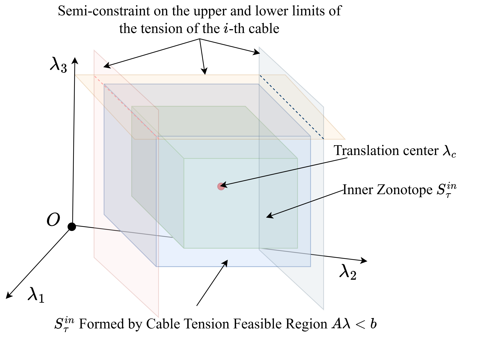
*Figure 5(a): Inner zonotope constructed in the redundancy space.*

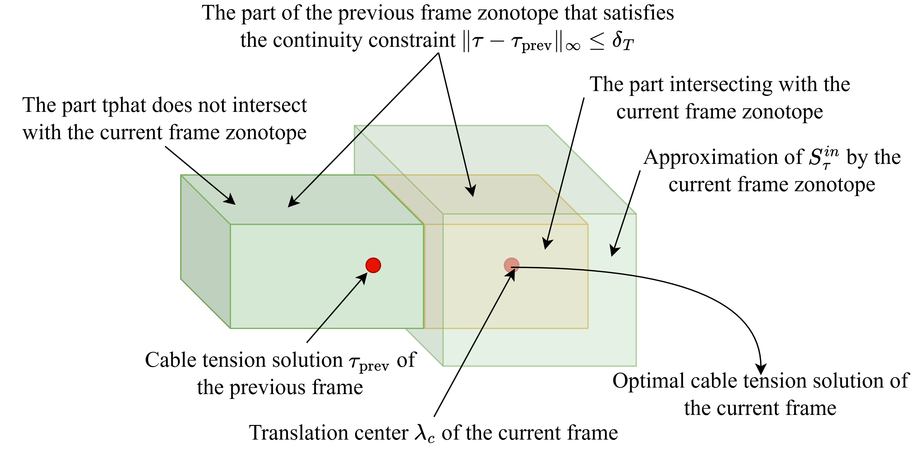
*Figure 5(b): Ideal case of preferred solution selection under continuity constraints.*

*Figure 5: Construction of inner zonotope in the redundancy space.*

Next, a continuity constraint in tension space is introduced to explicitly model temporal continuity. This helps reduce system vibration and ensures smooth tension evolution. In redundant CDPRs, physical feasibility and temporal continuity are two key criteria for evaluating tension solutions. In traditional quadratic programming methods, continuity is often added as a regularization term in the cost function. This can increase optimization time. Instead, this paper models continuity as a convex set in the tension space. The intersection of this set with the tension zonotope is used to directly generate candidate solutions that satisfy both constraints, achieving feasible and continuous tension allocation.

In mathematics, a function $f: \mathbb{R} \to \mathbb{R}^n$ is continuous at $t_0$ if for any $\varepsilon > 0$, there exists $\delta > 0$ such that $\|f(t) - f(t_0)\| \leq \varepsilon$ whenever $|t - t_0| < \delta$.

Similarly, given the previous tension output $\boldsymbol{\tau}_{\text{prev}} \in \mathbb{R}^m$, an $L_\infty$ norm window constraint is introduced to limit abrupt changes in the current tension:
$$
\|\boldsymbol{\tau} - \boldsymbol{\tau}_{\text{prev}}\|_\infty \leq \delta_\tau
$$

Here, $\delta_\tau > 0$ is a scalar step limit set according to practical requirements. Geometrically, this constraint defines an axis-aligned hypercube centered at $\boldsymbol{\tau}_{\text{prev}}$ with side length $2\delta_\tau$. This hypercube can also be represented as a zonotope. The $L_\infty$ norm is chosen instead of the $L_2$ norm because all cables and motors typically share the same specifications and control parameters. Using a uniform $\delta_\tau$ is therefore natural. Moreover, the $L_\infty$ norm bounds the maximum change in any single cable tension. In contrast, the $L_2$ norm may allow one cable to change significantly while keeping the overall norm small, which poses a safety risk. As shown in Figure 5(b), a continuity zonotope is built around the previous frame's tension, and another zonotope is constructed for the current frame. Their union is analyzed, and preferred solutions are selected based on their relative configuration.

The next step focuses on hierarchical candidate selection. Satisfying only tension bounds or only continuity is insufficient for stable performance. The former may cause large jumps and vibration. The latter may conflict with physical limits. Therefore, an ideal candidate should lie in the intersection of the feasible tension set $S_\tau^{\text{in}}$ and the continuity window $C(\delta_\tau)$. However, $S_\tau^{\text{in}}$ is generally an asymmetric polytope, making exact intersection with a hypercube computationally difficult. To address this, the inner zonotope approximation $S_\tau^{\text{in}}$ is used. A sampled intersection between $S_\tau^{\text{in}}$ and $C(\delta_\tau)$ is computed, and a hierarchical selection mechanism further narrows the candidate set to handle different operating conditions.

Two key sets are involved in the proposed method. The first is the continuity window:
$$
C(\delta_\tau) = Z(\boldsymbol{I}\delta_\tau,\,\boldsymbol{\tau}_{\text{prev}}) = \{\boldsymbol{\tau} \in \mathbb{R}^m \mid \|\boldsymbol{\tau} - \boldsymbol{\tau}_{\text{prev}}\|_\infty \leq \delta_\tau\}
$$
The second is the inner approximating zonotope of the tension feasible region:
$$
S_\tau^{\text{in}} = Z(\boldsymbol{G}_{\text{in}},\,\boldsymbol{c}_{\text{in}})
$$

The relative position of these two sets in the $m$-dimensional tension space directly affects solution properties. This relationship forms the theoretical basis for the hierarchical selection strategy. Three cases are considered by analogy to geometric configurations in three-dimensional space: intersecting, disjoint but close, and widely separated.

As shown in Figure 5(b), when $C(\delta_\tau) \cap S_\tau^{\text{in}} \neq \varnothing$, the two sets have a nonempty intersection. This is the ideal case. At least one solution exists that satisfies both physical constraints and continuity requirements.

As shown in Figure 6(a), when $C(\delta_\tau) \cap S_\tau^{\text{in}} = \varnothing$, the two sets do not intersect but are close in space. No feasible solution exists within the strict continuity window. This indicates that the tension distribution required by the current desired wrench $\boldsymbol{F}_{\text{desired}}$ differs significantly from the previous state. A conflict arises between strong continuity and feasibility constraints. Therefore, a relaxed strategy is adopted by expanding the continuity window to $C(\delta^{\text{rel}})$, where $\delta^{\text{rel}} > \delta_\tau$. A new intersection $C(\delta^{\text{rel}}) \cap S_\tau^{\text{in}}$ is then formed. If this intersection is nonempty, solutions satisfying both requirements can be selected. If it remains empty, the distance between the original sets is too large.

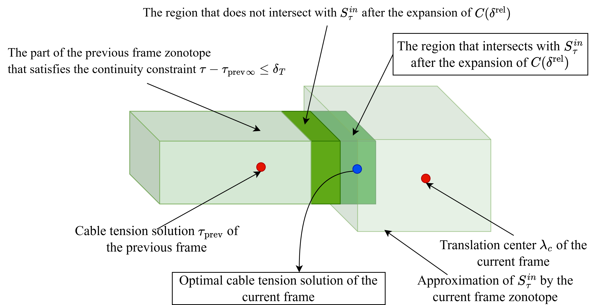
*Figure 6(a): Expanded continuity region intersects with the current tension region.*

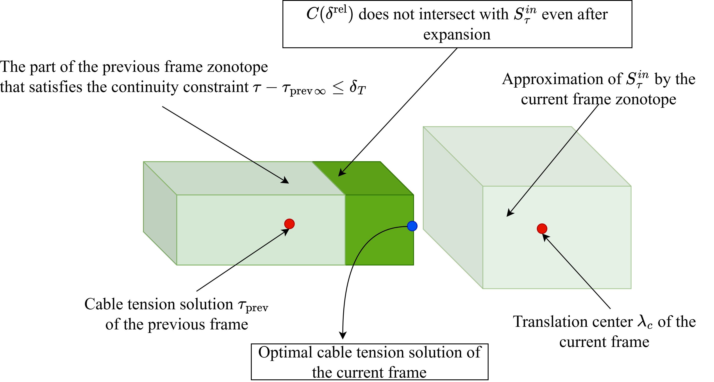
*Figure 6(b): Expanded continuity region still does not intersect with the current tension region.*

*Figure 6: Remaining two cases for ensuring continuity.*

In the case shown in Figure 6(b), even after relaxation, $C(\delta^{\text{rel}}) \cap S_\tau^{\text{in}} = \varnothing$. This suggests the system is under extreme conditions, such as strong external disturbances or erroneous abrupt task commands. Continuity is then prioritized over exact wrench tracking. A compromise solution is selected on the boundary of the continuity window. This point is the closest to the current approximate tension target $\boldsymbol{\tau}_p$. The operation is equivalent to solving a projection problem:
$$
\boldsymbol{\tau}_{\text{fallback}} = \arg\min_{\boldsymbol{\tau} \in C(\delta^{\text{rel}})} \|\boldsymbol{\tau} - \boldsymbol{\tau}_p\|_2
$$

This solution ensures continuity and moves as close as possible toward the current optimal target. Although it cannot achieve the desired wrench at this moment and is therefore suboptimal, it ensures system stability and cargo safety. Once the extreme condition passes, the system can resume normal trajectory tracking.

After the above steps, the candidate set is further reduced. The resulting set satisfies both continuity and feasibility constraints. However, multiple candidates may still remain. A selection criterion is then applied to choose a unique optimal solution.

The selection metric $ \mathcal{L}(\boldsymbol{\tau}) $ used in this paper is defined as
$$
\mathcal{L}(\boldsymbol{\tau}) = w_1 \underbrace{\frac{\|\boldsymbol{J}\boldsymbol{\tau} - \boldsymbol{F}_{\text{desired}}\|}{\|\boldsymbol{F}_{\text{desired}}\| + \varepsilon}}_{\text{force tracking}} + w_2 \underbrace{\frac{\|\boldsymbol{\tau} - \boldsymbol{\tau}_{\text{prev}}\|_\infty}{\delta_\tau}}_{\text{continuity}} + w_3 \underbrace{\frac{\|\boldsymbol{\tau} - \boldsymbol{\tau}_p\|_\infty}{\|\boldsymbol{\tau}_p\|_\infty + \varepsilon}}_{\text{energy efficiency}}
$$

This is a weighted linear combination. Three normalized terms with different units and meanings are merged into a single scalar value. The weight $w_1 \in \mathbb{R}$ corresponds to force tracking error. Since accurate wrench realization is the primary objective, $w_1$ is set significantly larger than the other two weights. The weight $w_2 \in \mathbb{R}$ penalizes tension changes and uses the $L_\infty$ norm to further limit the maximum variation relative to the previous frame. The weight $w_3 \in \mathbb{R}$ measures deviation from the pseudo-inverse solution $\boldsymbol{\tau}_p$. Although $\boldsymbol{\tau}_p$ may not satisfy tension bounds, it typically yields lower energy consumption. This term helps balance energy efficiency.
$$
\boldsymbol{\tau}_{\text{opt}} = \arg\min_{\boldsymbol{\tau}} \mathcal{L}(\boldsymbol{\tau})
$$

The relative values of $w_1$, $w_2$, and $w_3$ should be chosen according to practical requirements.

The algorithm requires the previous tension $\boldsymbol{\tau}_{\text{prev}}$ to compute the continuity constraint. At startup, no historical tension is available, so the continuity window cannot be defined. Therefore, a single-frame initialization method is needed. This paper adopts quadratic programming for initialization. The initial tension is obtained by solving
$$
\min_{\boldsymbol{\tau}} \|\boldsymbol{J} \boldsymbol{\tau} - \boldsymbol{F}_{\text{desired}}\|_2^2
\quad \text{subject to} \quad \tau_{\min} \leq \tau_i \leq \tau_{\max}, \; i = 1, \dots, m.
$$

As shown in Algorithm 1, the quadratic program provides the initial tension at the first frame. Subsequent frames use the proposed zonotope-based method for continuous tension allocation.

**Algorithm 1: Zonotope-Based Tension Allocation Algorithm**

```text
Input: Jacobian matrix J, desired wrench F_des, previous tension τ_prev (optional), 
       tension bounds τ_min, τ_max, continuity limit δ_τ, relaxation factor α > 1, 
       number of samples N
Output: Current tension τ_opt

1. If first frame (τ_prev undefined):
       Initialize via QP: min ||J τ - F_des||_2^2 s.t. τ_min ≤ τ ≤ τ_max
       τ_prev ← QP solution

2. Compute particular solution τ_p = J^+ F_des and null-space basis N
3. Construct H-representation Aλ ≤ b
4. Solve for inscribed hypercube radius ρ, yielding G_in = N diag(ρ), c_in = τ_p

5. Sample N vectors ξ^(j) ~ U[-1,1]^r, generate τ^(j) = c_in + G_in ξ^(j)
6. Filter candidates satisfying ||τ^(j) - τ_prev||_∞ ≤ δ_τ into set C_1

7. If C_1 = ∅:
       δ^rel ← min(δ_τ^max, α δ_τ)
       Form relaxed set C_2 = { τ^(j) | ||τ^(j) - τ_prev||_∞ ≤ δ^rel }
       If C_2 = ∅:
           τ_p ← J^+ F_des
           τ_fallback ← argmin_{τ ∈ C(δ^rel)} ||τ - τ_p||_2
           Return clip(τ_fallback, τ_min, τ_max)
       C ← C_2
   Else:
       C ← C_1

8. τ_opt ← argmin_{τ ∈ C} L(τ)
9. Return τ_opt
```

> **Remark:** The proposed zonotope-based tension allocation algorithm offers a new perspective on actuation redundancy in cable-driven systems operating under dynamic marine disturbances. Instead of using redundancy solely for energy minimization or stiffness maximization, this work treats it as a geometric resource that enables temporal continuity in the presence of abrupt external changes. By representing both physical feasibility and continuity requirements as convex sets and seeking their intersection in a reduced null-space parameterization, the method embeds robustness directly into the solution structure rather than relying on post-hoc optimization penalties. This approach is especially valuable in offshore cargo transfer where wave-induced wrench variations can invalidate quasi-static assumptions within a single control cycle. The effectiveness of the proposed method will be validated through comparative studies presented in Section 3.1 and Section 3.2.
>
> ## Simulation validation of the zonotope-based continuous tension allocation method

This Section compares the null-space method, the quadratic programming (QP) method, and variants of the proposed method with different selection weights. The comparison focuses on continuity performance and the ability to handle acceleration constraints inherent in suspended cable-driven configurations. This validates the superiority of the proposed algorithm.

### Simulation setup

All simulations are conducted in MATLAB R2023b on a desktop workstation equipped with an Intel Core i5-14600KF CPU, NVIDIA RTX 4060, and 32 GB RAM. The suspended 8-cable CDPR features a rectangular frame with fixed anchor points $\boldsymbol{p}_i^{\text{base}}$ (in meters) defined as:

$$
\boldsymbol{p}_i^{\text{base}} = 
\begin{bmatrix}
5.65 & 4.65 & 0 & 0 & -5.65 & -4.65 & 0 & 0 \\
0 & 0 & -5.25 & -4.25 & 0 & 0 & 5.25 & 4.25 \\
5.00 & 5.00 & 5.00 & 5.00 & 5.00 & 5.00 & 5.00 & 5.00
\end{bmatrix}^\top
$$

and moving-platform attachment points $\boldsymbol{p}_i^{\text{mp}}$ given by:

$$
\boldsymbol{p}_i^{\text{mp}} = 
\begin{bmatrix}
1.00 & 0 & -1.00 & 0 & 0 & 0.20 & 0 & -0.20 \\
0 & -1.00 & 0 & 1.00 & 0.20 & 0 & -0.20 & 0 \\
0 & 0 & 0 & 0 & 0 & 0 & 0 & 0
\end{bmatrix}^\top
$$

The platform possesses 5 degrees of freedom with a mass of $m = 5000\,\text{kg}$. Both the port-Hamiltonian dynamics and the passivity-based sliding-mode controller are adopted from [hou_2026]. The system evolves according to:

$$
\begin{pmatrix}
\dot{q} \\ \dot{p}
\end{pmatrix} = 
\begin{pmatrix}
0_5 & I_5 \\ -I_5 & -R_0(q, p)
\end{pmatrix}
\begin{pmatrix}
\nabla_q H_0 \\ \nabla_p H_0
\end{pmatrix} + 
\begin{pmatrix}
0_5 \\ I_5
\end{pmatrix}(u_0 + d)
$$

where $H_0(q, p) = \frac{1}{2}p^\top M^{-1}p + V(q)$, $q, p \in \mathbb{R}^5$, and $R_0 = \mathrm{diag}(0.20, 0.30, 0.10, 0.13, 0.15)$. Tension constraints are $100\,\text{N} \leq \tau_i \leq 90000\,\text{N}$, and the zonotope continuity parameter is set to $\delta_\tau = 50000\,\text{N}$. Numerical integration employs a fixed $1\,\text{ms}$ step size with the fourth-order Runge–Kutta method.

### Tension allocation performance under different allocators

The tension limits are set to $100\,\text{N} \leq \tau_i \leq 90000\,\text{N}$. The QP method and the null-space method are selected for comparative validation. The QP formulation is given by:

$$
\begin{aligned}
\min_{\boldsymbol{\tau}} &\quad \frac{1}{2}\|\boldsymbol{\tau}\|_2^2 \\
\text{s.t.} &\quad \boldsymbol{J} \boldsymbol{\tau} = \boldsymbol{F}_{\text{desired}}, \\
&\quad \tau_{\min} \leq \tau_i \leq \tau_{\max}
\end{aligned}
$$

This QP represents a conventional energy-optimal allocation strategy that minimizes cable tension magnitudes while satisfying wrench equilibrium and physical bounds.

The null-space method uses the minimum-norm particular solution $\boldsymbol{\tau}_p = \boldsymbol{J}^{+} \boldsymbol{F}_{\text{desired}}$ and the null-space basis $\boldsymbol{N} = \text{null}(\boldsymbol{J})$. The general solution is $\boldsymbol{\tau} = \boldsymbol{\tau}_p + \boldsymbol{N}\boldsymbol{\lambda}$, where $\boldsymbol{\lambda} \in \mathbb{R}^{r}$ is a free parameter and $r = m - 5 = 3$ denotes the actuation redundancy. For the proposed zonotope-based method, the continuity parameter is set to $\delta_\tau = 50000\,\text{N}$. A 30-second trajectory is used. The initial pose of the moving platform is $[0.3, -1.3, 2.3, 0.0, 0.0]$.

The reference trajectory for the end-effector is a vertical descending spiral defined by:

$$
\begin{cases}
x(t) = r\cos(\omega t) \\
y(t) = r\sin(\omega t) \\
z(t) = z_0 + \dfrac{z_{\text{end}} - z_0}{T}t
\end{cases},\quad t \in [0,T]
$$

The radius is $r = 2\,\text{m}$, the initial height is $z_0 = 2.1\,\text{m}$, and the final height is $z_{\text{end}} = -10\,\text{m}$. The total duration is 30 seconds. The platform completes 6.5 revolutions, with orientation held constant at 0 rad.

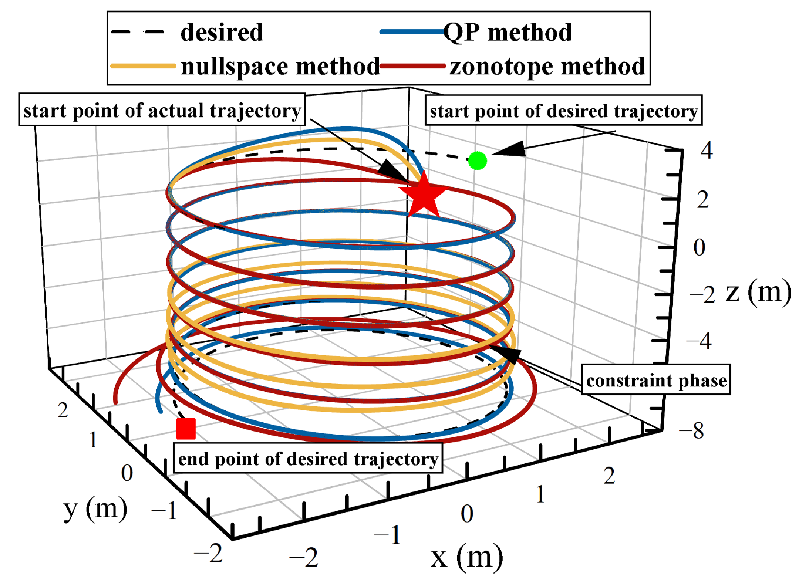
*Figure 7: Multi-directional coupled trajectory under different tension allocation algorithms.*

It should be noted that the suspended cable-driven parallel structure used in this work has a feasible region affected by platform gravity. The resulting acceleration constraint first manifests as a limited mapping from cable tensions to end-effector forces. If the tracking error becomes too large, the required end-effector wrench may exceed what the cables can deliver. Even when tensions approach the allowable upper bound $\tau_{\max}$, the desired wrench may still not be achievable. Tensions near this limit prevent the end-effector from following the controller's expected dynamic performance. Near the boundary of the feasible region, multi-directional coupled motion makes it difficult for tension allocation to satisfy force demands in all directions simultaneously. As a result, at the end of the trajectory, the platform fails to track the reference path. This limitation cannot be completely eliminated by control or allocation design. However, a well-designed tension allocator can plan suitable tensions to better utilize the available wrench-feasible space.

As shown in Figure 7, the platform trajectory is divided into three phases:
1. **Error convergence stage**: Due to large initial errors exceeding the maximum realizable end-effector wrench, the platform cannot follow the controller's desired wrench. Instead, it moves according to the actual wrench generated by each tension allocator. This phase tests the output performance of the three methods under large errors.
2. **Steady segment**: Evaluates steady-state tracking accuracy.
3. **Constrained segment**: Assesses how effectively each method exploits the feasible wrench space. Better utilization delays the onset of coupling-induced tracking degradation.

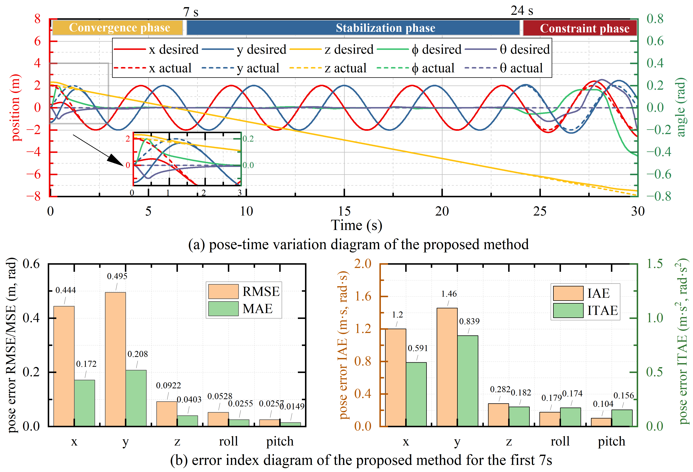
*Figure 8: Simulation of large-range trajectory in individual directions using the proposed method.*

As shown in Figure 8, during the first convergence phase, overshoot in all directions remains small. In contrast, Figures 11(a) and 14(a) show significant overshoot along the $z$-axis, which would cause cargo drift at the start of motion. Examining the error metrics in the first 7 seconds (Figure 8(b)), the proposed method does not yield the smallest errors in $x$ and $y$. However, along the $z$-axis, its RMSE and MAE are 0.0922 m and 0.0403 m, respectively, far lower than those of the other two allocators. Angular errors are also significantly smaller. Overall, the trajectory exhibits superior comprehensive performance.

This behavior stems from the gravity-induced acceleration constraint discussed earlier. When the required end-effector wrench becomes excessively large due to tracking error, cable tensions become strongly coupled across directions. On one hand, as shown in Figures 12 and 15, traditional methods such as QP and null-space allocate tensions close to $\tau_{\max}$ and exhibit abrupt tension changes later in the motion, demanding high actuator performance. On the other hand, these methods fail to balance force output levels across directions, leading to overshoot in individual axes. In contrast, Figure 8 demonstrates that the proposed tension allocator achieves better compatibility in coupled-direction motion.

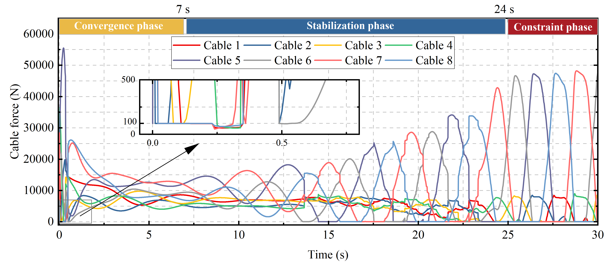
*Figure 9: Tension time evolution using the proposed method.*

Analysis of Figures 9 and 10 shows that the proposed algorithm incorporates a continuity metric during design. Therefore, current-frame tensions are generated based on the previous frame. The tension change per frame remains small, leading to more reasonable motor force output. In Figure 10, the tension distribution is relatively uniform. This indicates that tension variations stay within the designed range. Moreover, as shown in Figures 12, 13, and 15, the null-space method reaches the tension upper limit $\tau_{\max}$ at the beginning when tracking error is large. As the error decreases, its tension changes dramatically. Consequently, Figure 13 exhibits large tension outliers, indicating abrupt variations that may damage the motors. Similarly, Figures 15 and 16 show that the QP method suffers from the same issue.

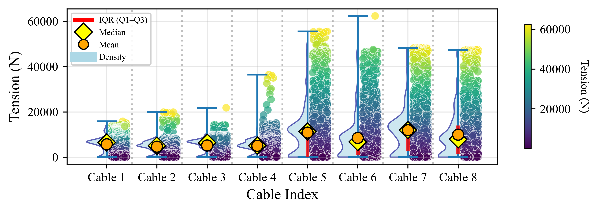
*Figure 10: Tension distribution statistics using the proposed method.*

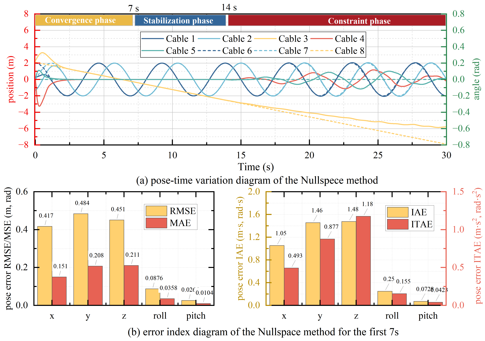
*Figure 11: Large-range trajectory simulation in individual directions using the null-space method.*

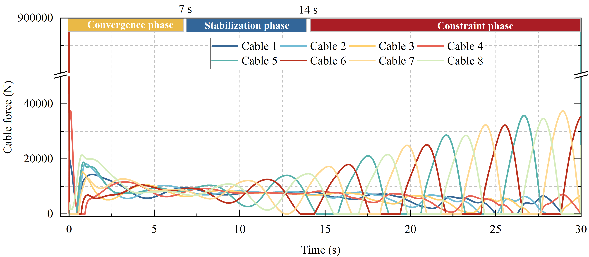
*Figure 12: Tension time evolution using the null-space method.*

In addition, gravity affects the suspended configuration by compressing the feasible wrench space. This is reflected in the platform trajectory near the boundary of this space. The timing boundaries between the steady and constrained segments in Figures 8(a), 11(a), and 14(a) further confirm this effect. Since the null-space method does not include additional optimization criteria, its tension decomposition is relatively simple. This leads to insufficient handling of the acceleration constraint caused by gravity.

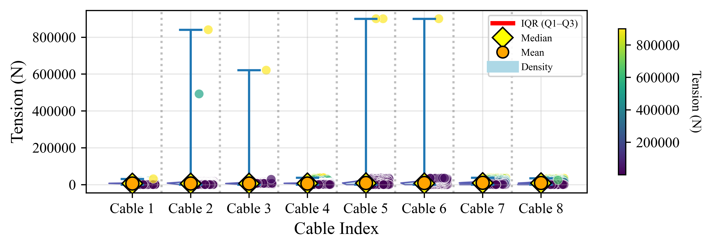
*Figure 13: Tension distribution statistics using the null-space method.*

In Figure 11(a), the trajectory enters the constrained segment at 14 seconds and begins to lose tracking. This confirms that the null-space method has the weakest capability in handling the acceleration constraint induced by gravity. In contrast, both the proposed method and the QP method perform better. They maintain stable tracking until around 24 seconds, when the platform approaches the boundary of the feasible region beyond which no algorithm can compensate.

Moreover, all algorithms keep tensions within the prescribed bounds $[\tau_{\min}, \tau_{\max}]$, satisfying the basic requirement of feasible tension allocation. However, the differences in trajectory performance and tension values reflect distinct design philosophies. The proposed method places greater emphasis on continuity and rational tension distribution. It considers multiple criteria—such as force tracking, smoothness, and energy efficiency—and assigns appropriate weights to balance them in the final solution.

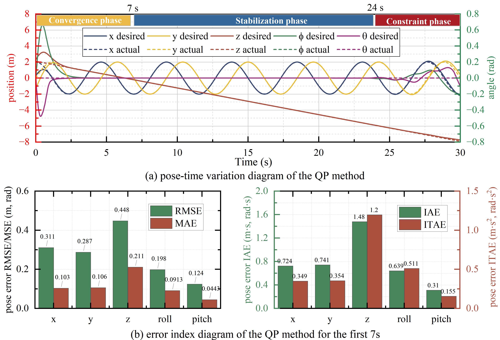
*Figure 14: Large-range trajectory simulation in individual directions using the QP method.*

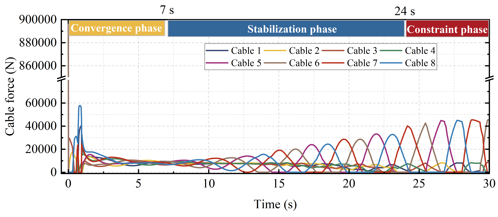
*Figure 15: Tension time evolution using the QP method.*

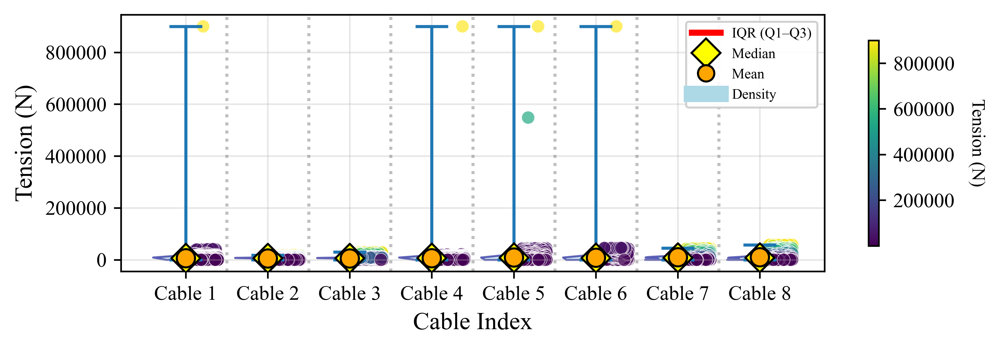
*Figure 16: Tension distribution statistics using the QP method.*

The above simulations compare motion performance across different phases of the same trajectory. They highlight the advantages of the proposed method in continuity and compatibility under coupled motion. The proposed method integrates continuity and force error metrics into its design. This reduces tension variations between consecutive frames, lowers the requirement for high-performance motors, and mitigates additional cargo swing caused by force fluctuations. In contrast, the QP method and the null-space method do not incorporate previous tension data. They respond only to instantaneous wrench error. As a result, their tension allocations cannot balance tracking errors across multiple directions, leading to extra cargo oscillation.

### Performance analysis under sudden disturbance with different tension allocators

This subsection introduces a sudden disturbance applied to the moving platform payload from 7 s to 17 s. The disturbance appears abruptly at 7 s and gradually decays to zero by 17 s. The disturbance force $d_i(t)$ along the $i$-th direction is defined as:

$$
d_i(t)=
\begin{cases}
g(t) \cdot A_i \sum_{k=1}^3 w_k \cos\left(2\pi k f_0(t-t_0)+\phi_k\right), & t_0 \leq t \leq t_0+T_d, \\
0, & \text{otherwise}
\end{cases}
$$

Here, $A_i$ is the base amplitude for the $i$-th degree of freedom, with $\boldsymbol{A} = [150000\; 100000\; 125000\; 25000\; 25000\; 25000]$. The base frequency $f_0$ is set to $1\,\text{Hz}$. The harmonic weights are $w_k \in \{1.0, 0.25, 0.15\}$, and the phases $\phi_k$ are all zero. The time-varying gain $g(t)$ is given by:

$$
g(t) = g_{\infty} + (g_0 - g_{\infty})e^{-\frac{t-t_0}{T}}, \quad t_0 \leq t \leq t_0+T_d
$$

where $g_0 = 2.0$, $g_{\infty} = 0.6$, and $T = 2.0\,\text{s}$.

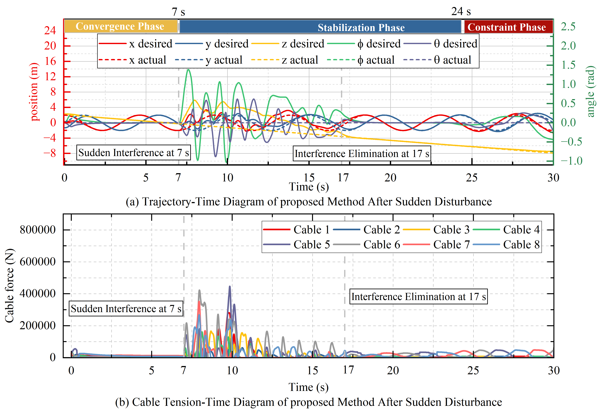
*Figure 17: Large-range trajectory simulation in base directions under sudden disturbance using the proposed method.*

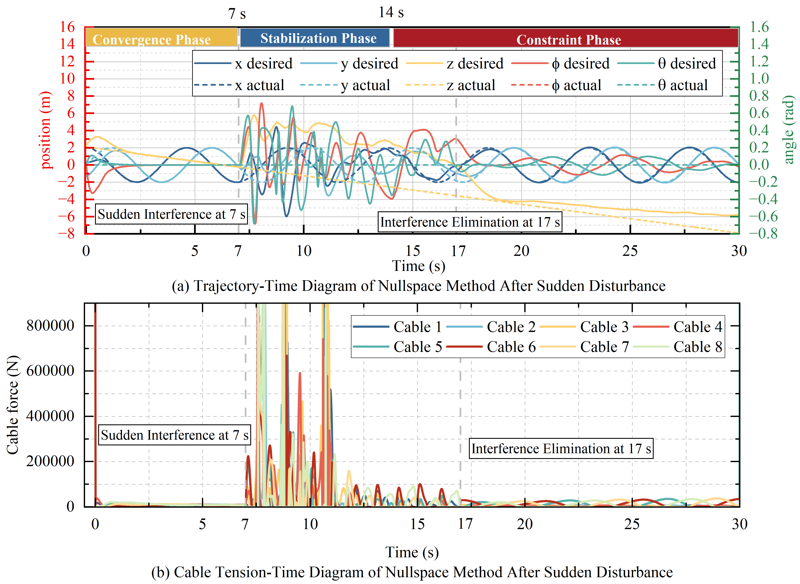
*Figure 18: Large-range trajectory simulation in individual directions under sudden disturbance using the null-space method.*

As shown in Figures 17, 18, and 19, a sudden disturbance is added to the baseline simulation to evaluate how the three tension allocators respond to abrupt external forces. From Figure 17, it can be seen that when the disturbance occurs, the required end-effector control wrench increases. This affects the real-time tension decomposition. The proposed method incorporates both continuity and force error constraints. It plans the current tension based on the previous frame, resulting in a peak tension around 40000 N. Due to the mismatch between the actual and desired end-effector wrench, the tracking error of the payload gradually grows. However, the allocator maintains reasonable tension output levels, balances coupled motion, and avoids introducing new vibrations caused by excessive tension changes. This helps protect both personnel and the compensation system under large external disturbances.

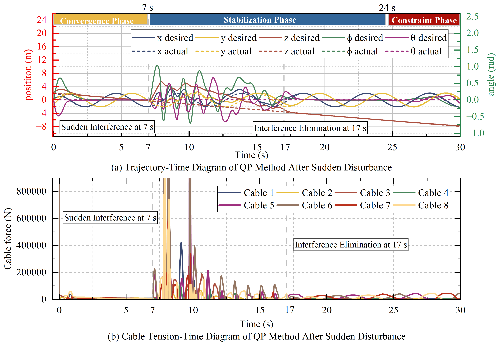
*Figure 19: Container placement simulation experiment.*

In contrast, Figure 18 shows that the null-space method, lacking continuity constraints, allocates large tensions immediately after the disturbance is applied. These tensions reach the preset upper limit of 90000 N. Since the end-effector wrench is mapped from multiple cable tensions through the Jacobian matrix, some cables exhibit large tension jumps between adjacent control cycles. This forces the motors to operate at high intensity to track the desired tensions. The resulting high-frequency tension fluctuations require rapid switching of motor output direction and magnitude. This causes severe current oscillations, excessive heating, and may trigger actuator saturation or protection mechanisms. Therefore, this method is unsuitable for real-world marine compensation tasks.

By comparison, Figure 19 shows that the QP method also produces tensions near the upper limit, but with much lower fluctuation frequency than the null-space method. This leads to slightly larger trajectory errors during the disturbance. However, because the QP method better exploits the feasible wrench space, the trajectory quickly converges after the disturbance ends. In contrast, the null-space method, despite smaller errors during the disturbance, fails to recover a stable trajectory afterward. Taken together, the proposed method achieves a balanced performance by effectively utilizing the feasible wrench space while maintaining tension continuity.

---

## Experimental validation of high-dimensional continuous tension allocation algorithm and replenishment procedure

### Experimental setup

As shown in Figure 20, a prototype was developed with electromagnets and a simulated container to realize a highly realistic cargo replenishment process.

Four electromagnets rated at 5 V, 0.25 A, and 3 kg holding force are mounted on the bottom of the moving platform for container pickup and release. The electromagnets are controlled via wireless relays to switch their magnetic state on or off. A 3 mm thick iron plate is attached to the simulated container to enable magnetic adhesion. Retroreflective markers are placed on both the moving platform and the Stewart platform. Their positions are captured by NOKOV motion capture system and broadcast to the host computer for processing. This provides the relative position between the two platforms. When this relative distance falls within a preset threshold of 10 mm, the relay is switched off, de-energizing the electromagnet and releasing the container onto the simulated deck.

Figure 21 shows that the device must operate within a reasonable workspace to achieve good tracking performance. Therefore, a five-phase replenishment procedure is designed based on the workspace of the suspended cable-driven wave motion compensation device:

| Phase                                    | Description                                                                                                                  |
| ---------------------------------------- | ---------------------------------------------------------------------------------------------------------------------------- |
| 1. Approach to optimal compensation zone | Platform follows a pure $z$-axis descending trajectory                                                                       |
| 2. Near-compensation                     | Descent continues while displacement compensation begins                                                                     |
| 3. Container placement                   | Platform reaches minimum height threshold, performs in-place compensation and releases container onto deck                   |
| 4. Compensated ascent                    | After placement, platform rises quickly but still performs limited pose-following compensation near deck to avoid collisions |
| 5. Rapid unassisted ascent               | Platform returns to initial position without active compensation                                                             |

This is the replenishment sequence planned in this work. The following experiments implement this procedure in a laboratory setting.

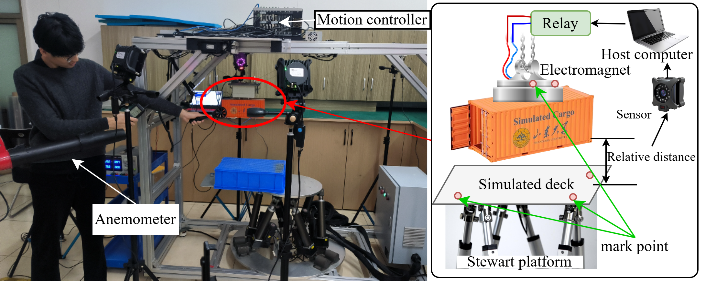
*Figure 20: Comparison of unidirectional displacement experimental data.*

The primary data include pose measurements of both the cargo and the simulated deck. Displacements are captured by a motion capture system. Angular data during operation are recorded by angle sensors mounted at the top and bottom. All signals are processed offline in MATLAB on the host computer. The electromagnets and relays are powered by a linear programmable power supply. The motion of the Stewart platform, which simulates ship deck movement, serves as the reference trajectory for cargo tracking.

### Experimental validation

**Table 1: Error metrics in unidirectional displacement and angular experiments**

| Trial   | $X_{\text{RMSE}}$ (mm) | $Y_{\text{RMSE}}$ (mm) | $Z_{\text{RMSE}}$ (mm) | $\phi_{\text{RMSE}}$ (°) | $\theta_{\text{RMSE}}$ (°) |
| ------- | ---------------------- | ---------------------- | ---------------------- | ------------------------ | -------------------------- |
| Trial 1 | 0.1869                 | 0.6313                 | 0.7560                 | 0.4744                   | 0.4586                     |
| Trial 2 | 0.1066                 | 0.4503                 | 0.3124                 | 0.9547                   | 0.0950                     |
| Trial 3 | 0.1608                 | 0.5319                 | 0.9998                 | 0.7302                   | 0.3387                     |

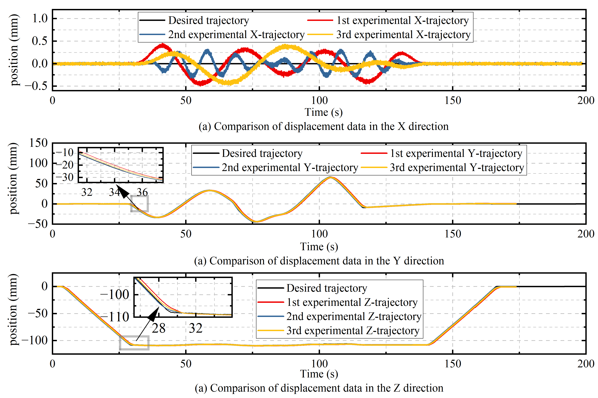
*Figure 21: Comparison of angular data in unidirectional experiments.*

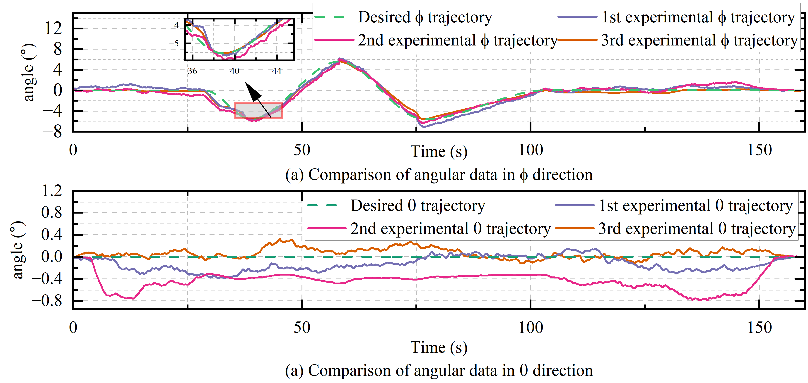
*Figure 22: Displacement comparison in integrated replenishment experiments under different controllers.*

The first experimental step validates the performance of the proposed zonotope-based tension allocation algorithm when integrated with a high-performance motion controller. Specifically, the passivity-based sliding mode controller from [hou_2026] is employed to compute the desired end-effector wrench $\boldsymbol{F}_{\text{desired}}$, which ensures robust trajectory tracking under model uncertainties and external disturbances. As shown in Table 1, the root-mean-square errors from three trials all remain below 1 mm. Figure 21 displays the time-varying position data in three directions. The actual trajectories closely match the desired ones across all trials.

As shown in Table 1, the error metrics in the primary motion direction remain below 1° across all three trials. Figure 22 shows the actual trajectory tracking results. A slight lag appears at points where the reference trajectory curvature changes, but overall the system demonstrates reliable angular tracking performance.

These unidirectional tracking experiments verify the basic feasibility of the proposed tension allocation algorithm and lay the foundation for the integrated replenishment test. The comprehensive replenishment experiment focuses on coupled trajectory tracking accuracy during multi-directional motion and compares different tension allocators to validate the superiority of the proposed method in terms of continuity, feasibility, and disturbance resilience.

The experiment shows that the proposed controller and tension allocator work effectively together in angular motion and ensure reliable trajectory tracking.

First, the Stewart platform executes random position oscillations within ±20 mm along the $Y$ direction and random angular oscillations within ±5° about the $\phi$ axis. This simulates the coupled wave-induced motion of a ship deck in real marine conditions. The cable-driven wave motion compensation device pulls the container model to follow the Stewart platform, but not continuously. The logic is as follows:

1. The device first lowers the container by 100 mm to reach the core region of the feasible wrench space.
2. It then reduces the descent speed and begins active compensation in other directions.
3. At this point, a blower is turned on to apply a sudden disturbance that persists until the end of the motion.
4. When the container approaches within 10 to 20 mm of the Stewart platform, the relay disconnects, de-energizing the electromagnet and releasing the container onto the platform.
5. After placement, the moving platform ascends under cable actuation while continuing to track the coupled motion of the Stewart platform.
6. Once it rises by 50 mm, active compensation stops and the platform quickly returns to its initial position.

The $X$-axis motion of this procedure can be seen in Figures 23(c), (f), and (i).

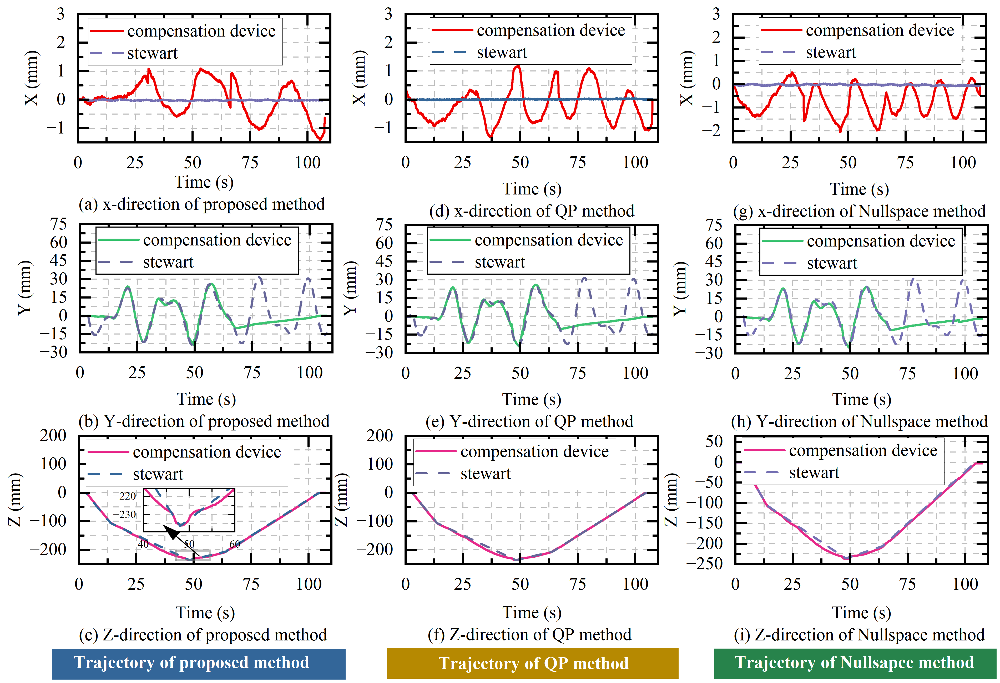
*Figure 23: Angular comparison in integrated replenishment experiments under different controllers.*

In the integrated replenishment experiment designed in this paper, the Stewart platform continuously performs reciprocating translational and rotational motion. However, the cargo does not track this motion at all times. Active following is only enabled when the cargo approaches the vicinity of the Stewart platform. Therefore, the platform motion cannot be directly used as the reference trajectory for the wave motion compensation device.

The evaluation method adopted here is to extract the segment during which active compensation is performed. As shown in Figures 23(b) and 24(b), the trajectory from 16 s to 68 s is selected for analysis. This interval corresponds to the active following phase. The motion of the Stewart platform during this period is treated as the desired trajectory. Error metrics between the cargo and this reference are then computed, as listed in Table 2.

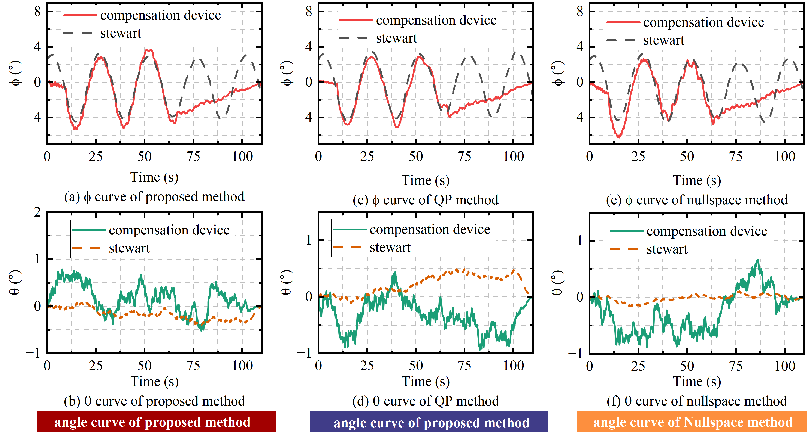
*Figure 24: Angular comparison in integrated replenishment experiments under different controllers.*

**Table 2: Error metric comparison of different allocators in integrated replenishment experiments**

| Allocator Type      | $X_{\text{RMSE}}$ (mm) | $Y_{\text{RMSE}}$ (mm) | $Z_{\text{RMSE}}$ (mm) | $\phi_{\text{RMSE}}$ (°) | $\theta_{\text{RMSE}}$ (°) |
| ------------------- | ---------------------- | ---------------------- | ---------------------- | ------------------------ | -------------------------- |
| Proposed allocator  | 0.5852                 | 1.9528                 | 5.2129                 | 0.5500                   | 0.3712                     |
| QP allocator        | 0.6462                 | 2.2662                 | 6.1519                 | 0.6648                   | 0.4642                     |
| Nullspace allocator | 0.9766                 | 2.0330                 | 6.6871                 | 0.8654                   | 0.5394                     |

Table 2 presents the RMSE values of trajectory tracking errors during the active compensation phase. The results show that the combination of the proposed controller and the proposed tension allocator achieves the highest overall accuracy. On one hand, the controller reduces vibration along the motion directions. On the other hand, under sudden disturbances, the tension allocator avoids abrupt increases in cable forces within one or two control cycles. This further mitigates system vibration caused by rapid motor acceleration.

Although larger tensions could theoretically improve tracking accuracy, the suspended cable-driven wave motion compensation device is subject to gravity-induced acceleration constraints. These constraints prevent full realization of high-tension commands. Under coupled motion, the mapping from cable tensions to end-effector wrench is uneven across directions. As a result, tensions cannot be accurately projected onto the required wrench components, leading to degraded tracking precision. This observation is consistent with the findings in the simulation studies.

In summary, two unidirectional motion experiments and one integrated replenishment test with sudden disturbance validate the modular compatibility of the proposed end-effector controller. They also confirm that the proposed tension allocation method prevents error divergence under abrupt disturbances and adapts well to the structural characteristics of the suspended cable-driven parallel wave motion compensation system.

---

## Conclusion

This paper proposes a tension allocation method for suspended cable-driven parallel wave motion compensation devices. The method is centered on zonotope geometry and combines null-space parameterization with the H-representation of the tension feasible region (TFR). It establishes an allocation framework that requires no online optimizer and ensures strong real-time performance and continuity.

**Key contributions:**
- Constructs an inner zonotope in the low-dimensional null space to efficiently generate a set of "guaranteed-feasible" tension candidates.
- Designs a hierarchical candidate generation and weighted scoring mechanism to balance multiple objectives, including tracking accuracy, tension smoothness, and physical safety.
- Adopts a hold-in-place strategy at startup to reduce trajectory oscillation and ensure smooth initialization when historical tension data is unavailable.

**Validation results:**
- MATLAB simulations demonstrate that the method effectively handles coupled motion and makes good use of the tension feasible region. It achieves continuous tension variation, significantly suppressing end-effector vibration and the risk of cable slack.
- Laboratory experiments further validate its effectiveness. Both unidirectional and integrated replenishment tests under sudden disturbances show that the proposed allocator outperforms conventional QP and null-space methods in tracking accuracy and tension continuity.
- The system maintains stable cargo placement even under wind gusts and deck-like motions, confirming its suitability for maritime operations.

**Future work:**
1. Extend the framework to fully dynamic models that incorporate cable elasticity and motor dynamics.
2. Integrate vision-based deck motion prediction for enhanced situational awareness.
3. Develop real-time sea state adaptation mechanisms to improve autonomy in actual offshore environments.
4. Explore hardware-in-the-loop testing with full-scale prototypes to validate scalability and robustness under realistic marine conditions.


以下是将您提供的 BibTeX 参考文献转换为 **Markdown 格式的参考文献列表**，采用学术通用的编号格式（类似 IEEE 风格），支持点击跳转至 DOI 或原文链接：

---

## References

1. Zijie Wu, Huimin Ouyang, Menghua Zhang, and Tongtong Liu (2026). Improved non-singular fast terminal sliding mode control for 4DOF ship-mounted rotary cranes. *Mechanism and Machine Theory*, 219, 106329. https://doi.org/10.1016/j.mechmachtheory.2025.106329

2. Zongbin Hou, Ruihao Sui, and Yuan Chen (2026). Passivity-based variable damped sliding mode control for cable-driven wave motion compensation device under hybrid disturbances. *Information Sciences*, 726, 122742. https://doi.org/10.1016/j.ins.2025.122742

3. Yao Wang, Xinrui Lu, Yuantian Gao, and Yuan Chen (2025). An anti-swing control method combining deep learning prediction models with a multistate fractional-order terminal sliding mode controller for wave motion compensation devices. *Mechanical Systems and Signal Processing*, 223, 111819. https://doi.org/10.1016/j.ymssp.2024.111819

4. Yuefei Zuo, Xiaoyong Zhu, Li Quan, Chao Zhang, Yi Du, and Zixuan Xiang (2019). Active Disturbance Rejection Controller for Speed Control of Electrical Drives Using Phase-Locking Loop Observer. *IEEE Transactions on Industrial Electronics*, 66(3), 1748–1759. https://doi.org/10.1109/tie.2018.2838067

5. Tong Yang, Ning Sun, He Chen, and Yongchun Fang (2020). Swing suppression and accurate positioning control for underactuated offshore crane systems suffering from disturbances. *IEEE/CAA Journal of Automatica Sinica*, 7(3), 892–900. https://doi.org/10.1109/jas.2020.1003162

6. Xiang Jin, Wei Ye, and Qinchuan Li (2023). New indices for performance evaluation of cable-driven parallel robots: Motion/force transmissibility. *Mechanism and Machine Theory*, 188, 105402. https://doi.org/10.1016/j.mechmachtheory.2023.105402

7. Kefei Wen and Clement Gosselin (2022). Static Model-Based Grasping Force Control of Parallel Grasping Robots With Partial Cartesian Force Measurement. *IEEE/ASME Transactions on Mechatronics*, 27(2), 999–1010. https://doi.org/10.1109/tmech.2021.3077448

8. M. Gouttefarde and C.M. Gosselin (2006). Analysis of the wrench-closure workspace of planar parallel cable-driven mechanisms. *IEEE Transactions on Robotics*, 22(3), 434–445. https://doi.org/10.1109/tro.2006.870638

9. P.H. Borgstrom, B.L. Jordan, B.J. Borgstrom, M.J. Stealey, G.S. Sukhatme, M.A. Batalin, and W.J. Kaiser (2009). NIMS-PL: A Cable-Driven Robot With Self-Calibration Capabilities. *IEEE Transactions on Robotics*, 25(5), 1005–1015. https://doi.org/10.1109/tro.2009.2024792

10. Mahir Hassan and Amir Khajepour (2008). Optimization of Actuator Forces in Cable-Based Parallel Manipulators Using Convex Analysis. *IEEE Transactions on Robotics*, 24(3), 736–740. https://doi.org/10.1109/tro.2008.919289

11. Clément Gosselin and Martin Grenier (2010). On the determination of the force distribution in overconstrained cable-driven parallel mechanisms. *Meccanica*, 46(1), 3–15. https://doi.org/10.1007/s11012-010-9369-x

12. Valentina Mattioni, Edoardo Idà, and Marco Carricato (2022). Force-distribution sensitivity to cable-tension errors in overconstrained cable-driven parallel robots. *Mechanism and Machine Theory*, 175, 104940. https://doi.org/10.1016/j.mechmachtheory.2022.104940

13. Richard Verhoeven and Manfred Hiller (2002). Tension Distribution in Tendon-Based Stewart Platforms. In *Advances in Robot Kinematics* (pp. 117–124). Springer Netherlands. https://doi.org/10.1007/978-94-017-0657-5_13

14. Mahir Hassan and Amir Khajepour (2011). Analysis of Bounded Cable Tensions in Cable-Actuated Parallel Manipulators. *IEEE Transactions on Robotics*, 27(5), 891–900. https://doi.org/10.1109/tro.2011.2158693

15. Andreas Pott (2013). An Improved Force Distribution Algorithm for Over-Constrained Cable-Driven Parallel Robots. In *Computational Kinematics* (pp. 139–146). Springer Netherlands. https://doi.org/10.1007/978-94-007-7214-4_16

16. Tuong Phuoc Tho and Nguyen Truong Thinh (2023). Evaluating cable tension distributions of CDPR for virtual reality motion simulator. *Mechanics Based Design of Structures and Machines*, 52(8), 5817–5835. https://doi.org/10.1080/15397734.2023.2265452

17. Weihan Jia, Gang Cheng, Jun Li, Yusong Pang, Mengyao Hu, and Wei Gu (2025). A novel offline robust trajectory optimization index and method for underground mining cable-driven parallel robot. *Mechanism and Machine Theory*, 214, 106095. https://doi.org/10.1016/j.mechmachtheory.2025.106095

18. Marc Fabritius, Guillermo Rubio-Gómez, Christoph Martin, João Cavalcanti Santos, Werner Kraus, and Andreas Pott (2023). A nullspace-based force correction method to improve the dynamic performance of cable-driven parallel robots. *Mechanism and Machine Theory*, 181, 105177. https://doi.org/10.1016/j.mechmachtheory.2022.105177

19. Haibo Gao, Guangyao Sun, Zhen Liu, Cong Sun, Nan Li, Liang Ding, Haitao Yu, and Zongquan Deng (2022). Tension distribution algorithm based on graphics with high computational efficiency and robust optimization for two-redundant cable-driven parallel robots. *Mechanism and Machine Theory*, 172, 104739. https://doi.org/10.1016/j.mechmachtheory.2022.104739

20. Guangyao Sun, Zhen Liu, Haibo Gao, and Zongquan Deng (2025). FFS-CDPR: A free-floating simulator based on cable-driven parallel robots coordinating vibration from discontinuous external wrench. *Acta Astronautica*, 232, 80–93. https://doi.org/10.1016/j.actaastro.2025.02.036

21. Filippo Zoffoli, Edoardo Ida', and Marco Carricato (2025). Design and control optimization for hybrid-controlled overconstrained cable-driven parallel robots. *Mechanism and Machine Theory*, 209, 105998. https://doi.org/10.1016/j.mechmachtheory.2025.105998

22. Luca Guagliumi, Alessandro Berti, Eros Monti, Marc Fabritius, Christoph Martin, and Marco Carricato (2024). Force-Sensor-Free Implementation of a Hybrid Position–Force Control for Overconstrained Cable-Driven Parallel Robots. *Robotics*, 13(2), 25. https://doi.org/10.3390/robotics13020025

23. Adel Ameri, Amir Molaei, Mohammad A. Khosravi, Amir G. Aghdam, Javad Dargahi, and S. Mahdi Fazeli (2024). A Real-Time Approach to Risk-Free Control of Highly Redundant Cable-Driven Parallel Robots. *IEEE Transactions on Systems, Man, and Cybernetics: Systems*, 54(5), 2651–2662. https://doi.org/10.1109/tsmc.2023.3349253

24. Yanqi Lu, Chengwei Wu, Weiran Yao, Guanghui Sun, Jianxing Liu, and Ligang Wu (2023). Deep Reinforcement Learning Control of Fully-Constrained Cable-Driven Parallel Robots. *IEEE Transactions on Industrial Electronics*, 70(7), 7194–7204. https://doi.org/10.1109/tie.2022.3203763

25. Yanqi Lu and Weiran Yao (2025). Active fault-tolerant hybrid control integrated with reinforcement learning application to cable-driven parallel robots. *Control Engineering Practice*, 158, 106277. https://doi.org/10.1016/j.conengprac.2025.106277

26. Muhammad Kamran Joyo, Abdulmajeed M. Alenezi, Wenfu Xu, Mohamad A. Alawad, Muhmmad Tayyab Yaqoob, Noor Maricar, and Sheroz Khan (2025). Controlling Cable Driven Parallel Robots Operations—Deep Reinforcement Learning Approach. *IEEE Access*, 13, 36212–36223. https://doi.org/10.1109/access.2025.3539702

